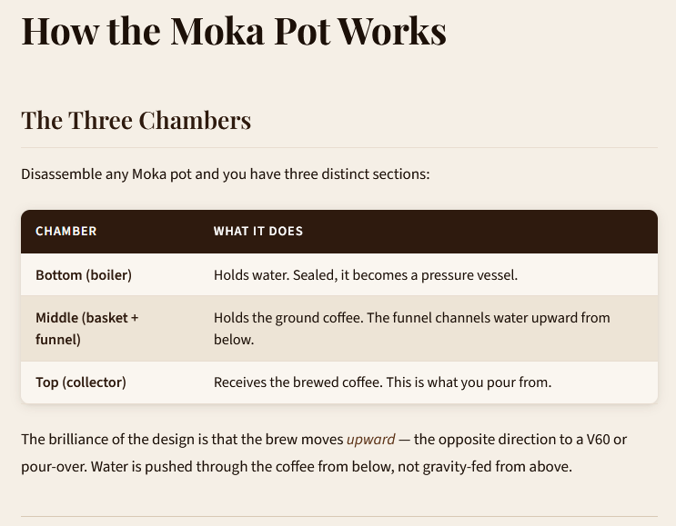
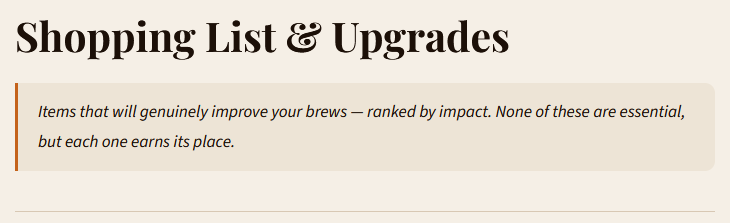
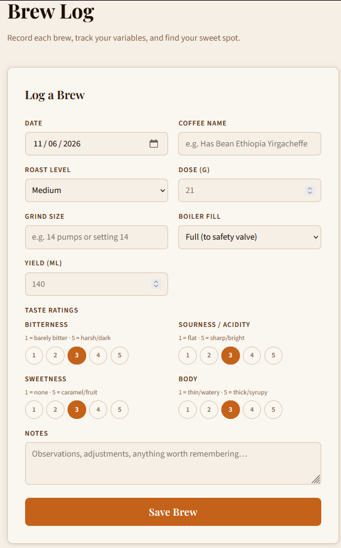

# Moka Companion

A PWA for the Bialetti Moka pot. Covers the history, technique, and science of stovetop espresso, plus a personal brew log with taste ratings and CSV export.

<p align="center">
  
</p>

## Background

I wanted espresso-quality coffee at home without spending £200–300 on a machine. The kitchen is small, so counter space is precious — the Bialetti Moka pot stood out as something cheap, compact, and capable of excellent coffee when used well.

James Hoffmann's YouTube series on the Moka pot is the foundation for most of the content here. I took the transcripts from those videos, turned them into markdown files, and asked Claude to build this app around them. The result is something I can open each morning as part of the routine — check the recipe, remind myself of the variables, then log the brew.

The brew log is what makes it useful day-to-day. Coffee is an experimentation game: once you land on a great cup you want to reproduce it exactly. Dose, grind size, yield, and taste ratings in one place makes that possible.

## Features

- **Brew guide** — step-by-step recipe with a persistent quick-reference card
- **Technique & science** — why heat management and grind size matter, explained
- **Kit checklist** — gear sorted by priority, ticked items saved to local storage
- **Brew log** — log each brew with dose, grind, yield, taste ratings (bitterness, acidity, sweetness, body), and notes
- **CSV export** — one tap to download your full brew history
- **Troubleshooting accordion** — diagnose common problems (bitter, sour, stalled, sputtering)
- **PWA** — installs to home screen on iOS and Android, works offline

## Screenshots

<p align="center">
  
  &nbsp;&nbsp;
  
</p>

<p align="center">
  
</p>

## Usage

Open `index.html` through a local web server. Opening as a `file://` URL will break the markdown loading.

```bash
# Python
python3 -m http.server 8080

# Node
npx serve .
```

Then go to `http://localhost:8080`.

## Data & storage

Everything stays on your device. Brew logs and kit list ticks are saved to your browser's local storage — nothing is sent to a server, and there's no account. This also means data doesn't sync between devices; logs saved on your phone won't appear on your laptop.

To move your data, use the CSV export on the Brew Log tab.

## Tech

Vanilla HTML, CSS, and JavaScript. No build step, no dependencies beyond [marked.js](https://marked.js.org) (loaded from CDN) for markdown rendering.

## License

MIT
